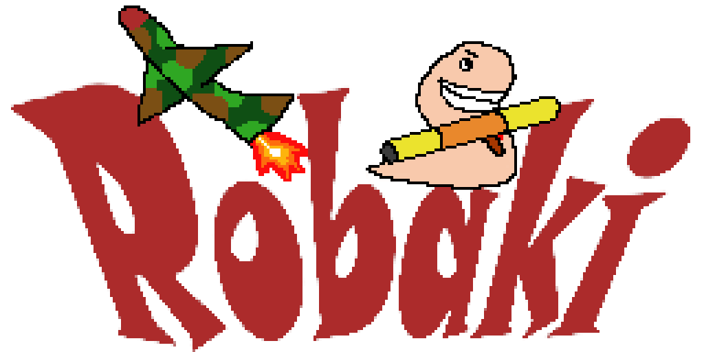

# Robaki
Worms-like game written in System Verilog, developed for the Basys3 board.

This is a project for the UEC2 class at the Microelectronics course at AGH University.

## Requirements
- Basys3 board
- PMODAMP2
- Keyboard
- VGA display

### Project WIKI

[GOTO wiki](doc/project_docs/index.md)

#### Developed by:
- Maciej Piofczyk 
- Kacper Sokołowski
